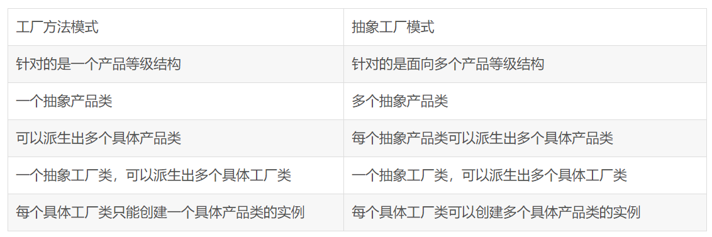

# 抽象工厂模式

抽象工厂模式用于生成具有多产品种类生产能力的的工厂，所生成的对象往往是有关联的。

如果抽象工厂退化成生成的对象无关联的或者单一的产品种类则成为工厂函数模式。

参考：[对比](https://blog.csdn.net/wyxhd2008/article/details/5597975)

比如本例子中使用RDB和XML存储订单信息，抽象工厂分别能生成相关的主订单信息和订单详情信息。
如果业务逻辑中需要替换使用的时候只需要改动工厂函数相关的类就能替换使用不同的存储方式了。
